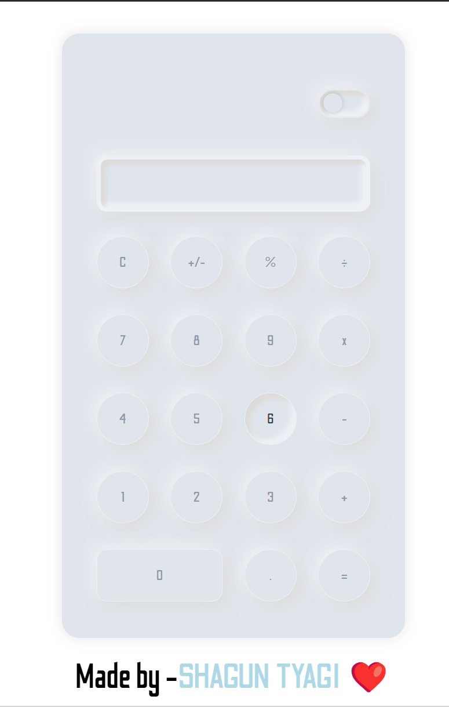
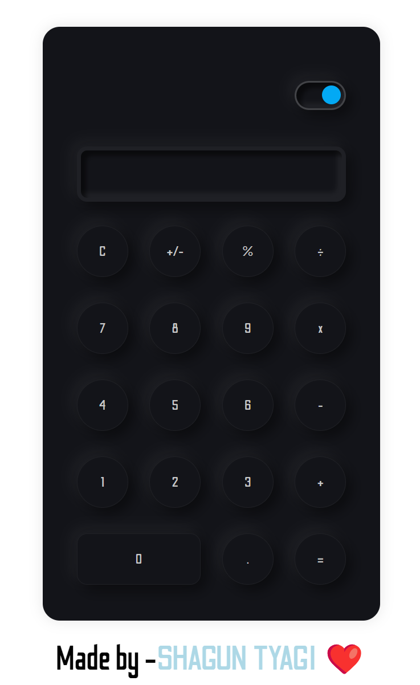

# Calculator with Light/Dark Theme

This repository contains a simple calculator web application with a toggleable light/dark theme. The calculator has a neumorphic design, providing a sleek and modern appearance. The project includes HTML, CSS, and JavaScript files for the calculator, as well as a readme file for documentation.

## Features

- **Light/Dark Theme Toggle:** Users can switch between light and dark themes for a personalized experience.
- **Neumorphic Design:** The calculator has a neumorphic (soft and embossed) design, providing a modern and aesthetic look.
- **Basic Calculator Functions:** The calculator supports basic arithmetic operations, including addition, subtraction, multiplication, and division.
- **Clear and Responsive Layout:** The layout is organized and responsive, ensuring a consistent user experience across different devices.

## Access

You can check the website by [clicking here](https://theshaguntyagi.github.io/Calculator).

## Usage

1. Clone the repository:

   ```bash
   git clone https://github.com/your-username/calculator-light-dark-theme.git

## Screenshots

Include screenshots of the calculator in both light and dark themes to showcase its appearance.

### Light Theme


### Dark Theme


## How to Contribute

If you would like to contribute to the project, follow these steps:

**1.** Fork the repository.
**2.** Create a new branch: git checkout -b feature-new-feature.
**3.** Make your changes and commit them: git commit -m 'Add new feature'.
**4.** Push to the branch: git push origin feature-new-feature.
**5.** Submit a pull request.

## Credits

- **Author:** [theshaguntyagi](https://github.com/theshaguntyagi)
- **Instagram:** [theshaguntyagi](https://www.instagram.com/theshaguntyagi/)


Feel free to customize this readme file based on your preferences and additional project details. Make sure to include appropriate credit and licensing information.

<div align="center">Made with ❤️</div>
